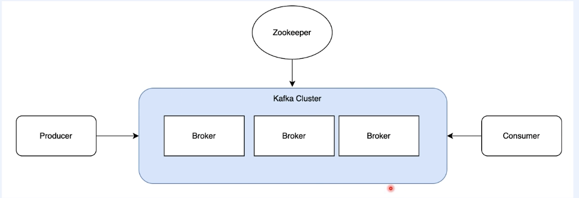
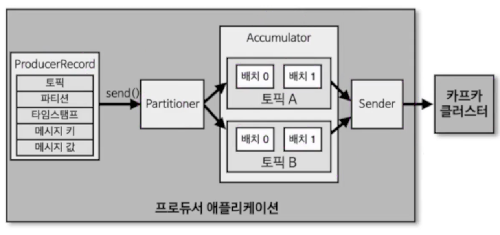

# Apache Kafka

<br><br>

## 개념 정리
### 카프카가 데이터 파이프라인으로 적합한 이유
- 높은 처리량
  - 카프카는 프로듀서가 브로커로 데이터를 보낼 때와 컨슈머가 브로커로부터 데이터를 받을 때, 모두 묶어서 전송하고 받는다.
  - 많은 양이 많아지면, 데이터를 송수신할 때 맺어지는 네트워크 비용은 무시할 수 없는 규모가 되는데 네트워크 통신 횟수를 줄일다면 동일 시간 내에 더 많은 데이터를 전송할 수 있다.
  - 파티션 단위를 통해 동일 목적의 데이터를 여러 파티션에 분배하고 데이터를 병렬 처리할 수 있다.
- 확장성
  - 카프카는 가변적인 환경에서 안정적으로 확장 가능하도록 설계되었다.
  - 데이터가 많아지면 클러스터의 브로커 개수를 자연스럽게 늘려 스케일 아웃할 수 있다.
- 영속성
  - 카프카는 다른 메시징 플랫폼과 다르게 데이터를 메모리에 저장하지 않고, 파일 시스템에 저장한다.
  - 파일 시스템을 이용하다보니 느리다고 생각할 수 있겠지만, 파일I/O 성능 향상을 위해 페이지 캐시 영역을 메모리에 따로 생성하여 사용한다.
    - 한 번 읽은 파일 내용은 메모리에 저장시켰다가 다시 사용하는 방식이기 때문에 성능이 향상된다.
  - 파일 시스템을 활용하기 때문에 장애가 발생하여 급작스럽게 종료되더라도 프로세스를 재시작하여 안전하게 데이터를 다시 처리할 수 있다.
- 고가용성
  - 3개 이상의 서버들로 운영되는 카프카 클러스터는 일부 서버에 장애가 발생하더라도 무중단으로 안전하고 지속적인 데이터 처리가 가능하다.

### 카프카 브로커
- 
  - 카프카 브로커는 카프카 클라이언트와 데이터를 주고받기 위해 사용하는 주체이다.
  - 데이터를 분산 저장하여 장애가 발생하더라도 안전하게 사용할 수 있도록 도와주는 애플리케이션이다.
  - 하나의 서버에는 하나의 브로커 프로세스가 실행된다.
  - 카프카 브로커 서버 1대로도 기본 기능이 실행되지만, 안전성을 위하여 3대 이상의 브로커 서버를 사용하고 이를 1개의 클러스터로 묶어 사용하기도 한다.
  - 카프카 클러스터를 실행하기 위해서는 주키퍼가 필요하다.
    - 주키퍼는 브로커들의 상태를 관리하고, 클러스터를 조율하기 위해 사용된다.
  - 카프카 3.0 부터는 주키퍼가 없어도 클러스터 동작이 가능하지만, 아직까지는 정식버전으로 지원하지는 않는다.

### 브로커의 역할
- 컨트롤러
  - 클러스터의 다수 브로커 중 한 대가 컨트롤러의 역할을 한다.
  - 컨트롤러는 다른 브로커들의 상태를 체크하고 브로커가 클러스터에서 빠지는 경우, 해당 브로커에 존재하는 리더 파티션을 재분배한다.
- 데이터 저장
  - server.properties의 log.dir 옵션에 정의한 디렉토리에 데이터를 저장한다.
- 데이터 삭제
  - 카프카는 다른 메시징 플랫폼과 다르게 컨슈머가 데이터를 가져가더라도 데이터가 삭제되지 않는다.
  - 또한 컨슈머나 프로듀서가 데이터 삭제 요청을 할 수도 없다.
  - 오직 브로커만이 데이터를 삭제할 수 있는데, 데이터 삭제는 파일 단위로 이루어지며 이 단위를 로그 세그먼트라고 부른다.
  - 세그먼트에는 다수의 데이터가 들어있으며, 일반적인 데이터베이스와 다르게 특정 데이터를 선별해서 삭제하는 것은 불가능하다.
- 컨슈머 오프셋 저장
  - 어느 레코드까지 가져갔는지 확인하기 위해 오프셋을 커밋한다.
    - 커밋한 오프셋은 __consumer_offsets 토픽에 저장된다.
- 그룹 코디네이터
  - 코디네이터는 컨슈머 그룹의 상태를 체크하고, 파티션을 컨슈머와 매칭되도록 분배하는 역할을 한다.
  - 컨슈머가 컨슈머 그룹에서 빠지면, 매칭되지 않은 파티션을 정상 동작하는 컨슈머로 할당하여 끊임없이 데이터가 처리되도록 도와준다.
    - 파티션을 컨슈머로 재할당하는 과정을 리밸런스(rebalance)라고 한다.
- 복제
  - 카프카는 복제를 통해 클러스터로 묶인 브로커 중 일부에 장애가 발생하더라도 데이터를 유실하지 않고 안전하게 사용할 수 있도록 처리해준다.
  - 카프카의 데이터 복제는 파티션 단위로 이루어진다.
  - 토픽을 생성할 때 파티션의 복제 개수(replication factor)를 설정할 수 있다.
    - 옵션을 선택하지 않으면 브로커에 설정된 옵션 값을 따라간다.
    - 복제 개수의 최솟값은 1(복제안함)이고 최댓값은 브로커 개수만큼 설정할 수 있다.
  - 복제된 파티션은 리더와 팔로워로 구성된다.
    - 프로듀서 또는 컨슈머와 직접 통신하는 파티션은 리더이며, 나머지 팔로워 파티션은 복제된 데이터를 가지고 있기위해 존재한다.
  - 리더 파티션이 사용할 수 없게되면, 팔로워 파티션 중 하나가 리더 파티션 지위를 넘겨받는다.
  - ISR(In-Sync Replica)
    - ISR은 리더 파티션과 팔로워 파티션이 모두 싱크된 상태를 뜻한다.
      - 상황에 따라 리더 파티션의 모든 데이터를 복제하지 못하였는데, 리더 파티션이 사용할 수 없게되는 경우도 있음. 
      - 이 때, 옵션에 따라 데이터 유실을 감수하고 팔로워 파티션을 리더로 승급할지 지정할 수 있다.
        - unclean.leader.election.enable=true
          - 데이터 유실을 감수함. 복제가 안된 팔로워 파티션을 리더로 승급.
        - unclean.leader.election.enable=false
          - 데이터 유실을 감수하지 않음. 해당 브로커가 복구될 때까지 중단.

### 토픽과 파티션
- 토픽
  - 토픽은 카프카에서 데이터를 구분하기 위해 사용하는 단위이다.
  - 토픽은 1개 이상의 파티션을 소유하고 있다.
- 파티션
  - 파티션에는 프로듀서가 보낸 데이터들이 들어가 저장되는데, 이 데이터를 레코드(record)라고 한다.
  - 파티션은 큐와 비슷한 구조이다.
    - 다만, 컨슈머가 데이터를 가져가도 삭제되지는 않는다.
    - 이러한 특징 때문에 여러 컨슈머 그룹들이 토픽의 데이터를 여러 번 가져갈 수 있다.
  - 파티션이 배치되는 방법
    - 3개의 브로커와 파티션이 5개인 토픽을 생성한다고 가정하면, 아래와 같이 round-robin 방식으로 생성 및 할당된다.
      - 브로커#0
        - 파티션 0
        - 파티션 3
      - 브로커#1
        - 파티션 1
        - 파티션 4
      - 브로커#2
        - 파티션 2
    - 만약 위와 같이 골고루 분배가 되지않고, 파티션 쏠림 현상이 발생할 경우 kafka-reassign-partitions.sh로 파티션을 재분배할 수 있다.
  - 파티션은 한 번 늘리면, 줄 일 수는 없다.

### 파티션 개수와 컨슈머 개수
- 파티션 수 > 컨슈머 수
  - 일부 컨슈머가 여러 파티션 담당 (1:N)
- 파티션 수 < 컨슈머 수
  - 일부 컨슈머는 할당 없음 (유휴 상태)
  - 올바르지 않은 설정이다.
- 파티션 수 = 컨슈머 수
  - 이상적인 1:1 매칭

### 레코드
- 레코드의 구성
  - 레코드는 타임스탬프, 오프셋, 헤더, 메시지 키, 메시지 값으로 구성되어 있다.
  - 타임스탬프
    - 타임스탬프는 스트림 프로세싱에서 활용하기 위한 시간을 저장하는 용도로 사용된다.
    - 프로듀서에서 따로 설정하지 않으면, 기본값으로 생성 시간이 들어간다.
  - 오프셋
    - 오프셋은 프로듀서가 생선한 레코드에는 존재하지 않는다.
    - 프로듀서가 전송한 레코드가 브로커에 적재될 때 생성된다.
    - 오프셋은 0부터 시작되고 1씩 증가한다.
    - 컨슈머는 오프셋을 기반으로 처리가 완료된 데이터와 앞으로 처리해야할 데이터를 구분한다.
  - 헤더
    - 레코드의 스키마 버전이나 포맷과 같은 데이터 프로세싱에 참고할 만한 정보를 담아서 사용할 수 있다.
  - 메시지 키
    - 처리하고자 하는 메시지 값을 분류하기 위한 용도로 사용된다. 이를 파티셔닝이라고 부른다.
    - 메시지 키는 필수 값이 아니며, 지정하지 않으면 null로 설정된다.
    - null이 아닌 메시지 키는 해쉬값에 의해서 특정 파티션에 매핑되어 전달된다.
  - 메시지 값
    - 실질적으로 처리할 데이터가 담기는 공간이다.
    - 메시지 값의 포맷은 제네릭으로 사용자에 의해 지정된다.

### 카프카 브로커와 클라이언트의 통신 방법
- 카프카 클라이언트는 통신하고자 하는 리더 파티션의 위치를 알기 위해 데이터를 주고 받기 전 메타데이터를 브로커로부터 전달받는다.
- 메타데이터는 다음과 같은 옵션을 통해 refresh된다.
  - metadata.max.age.ms
    - 메타데이터를 강제로 refresh하는 간격
  - metadata.max.idle.ms
    - 프로듀서가 유휴상태일 경우 메타데이터를 캐시에 유지하는 기간
    - 예를 들어 프로듀서가 특정 토픽으로 데이터를 보낸 이후 지정한 시간이 지나고 나면 강제로 메타데이터를 refresh 한다.
- 메타데이터의 이슈가 발생하는 경우
  - 카프카 클라이언트는 반드시 리더 파티션과 통신해야한다.
  - 만약 메타데이터가 현재의 파티션 상태에 맞게 refresh 되지 않은 상태에서 잘못된 브로커로 데이터를 요청하면 LEADER_NOT_AVAILABLE 예외가 발생한다.
  - 이는 브로커에 리더 파티션이 없는 경우 나타나며, 대부분 메타데이터 refresh 이슈로 발생한다.
  - 이러한 예외가 자주 발생하면, 메타데이터 refresh 간격을 확인해봐야한다.

### 프로듀서
- 프로듀서
  - 프로듀서 애플리케이션은 카프카에서 데이터의 시작점에 해당한다.
  - 프로듀서는 카프카에 필요한 데이터를 선언하고 브로커의 특정 토픽의 파티션에 전송한다.
  - 프로듀서는 데이터를 전송할 때 리더 파티션을 가지고 있는 카프카 브로커와 직접 통신한다.
- 내부구조
  - 
    - ProducerRecord
      - 프로듀서에서 생성하는 레코드
      - 오프셋은 미포함된다.
    - send()
      - 레코드를 전송 요청하는 메서드
    - Partitioner
      - 어느 파티션으로 전송할지 지정하는 파티셔너
      - 기본값으로는 DefaultPartitioner로 설정된다.
    - Accumulator
      - 배치로 묶어 전송할 데이터를 모으는 버퍼
  

<br><br>

## 카프카 CLI 실습
### 기본 환경 구성
- 아파치 카프카 다운로드
- 카프카 홈에 data 디렉토리 생성
  - 카프카가 설치된 경로는 {kafka_home}이라고 지칭할 예정
- {kafka_home}/config/server.properties 수정
  - listeners=PLAINTEXT://localhost:9092
  - advertised.listeners=PLAINTEXT://localhost:9092
  - log.dirs={kafka_home}/data

### 주키퍼 및 카프카 실행
- 주키퍼 실행
  - cd {kafka_home}
  - bin/zookeeper-server-start.sh config/zookeeper.properties
- 카프카 실행
  - cd {kafka_home}
  - bin/kafka-server-start.sh config/server.properties

### topic
- 토픽 생성
  - 클러스터 정보와 토픽 이름은 필수 값이다.
  - 파티션 개수, 복제 개수 등 다양한 옵션도 존재하지만, 값을 주지 않는다면 브로커에 설정된 기본 값으로 생성된다.
  - ``` 기본생성
    bin/kafka-topics.sh --create \
    --bootstrap-server localhost:9092 \
    --topic hello.kafka
    ```
  - ``` 다양한 옵션을 통해 생성
    bin/kafka-topics.sh --create \
    --bootstrap-server localhost:9092 \
    --partitions 10 \
    --replication-factor 1 \
    --topic hello.kafka2 \
    --config retention.ms=172800000
    ```
- 토픽 리스트 조회
  - ```
    bin/kafka-topics.sh --bootstrap-server localhost:9092 --list
    ```
- 토픽 상세조회
  - ```
    bin/kafka-topics.sh --bootstrap-server localhost:9092 --topic hello.kafka \
    --describe
    ```
- 파티션 개수 늘리기
  - 파티션 개수를 늘리기 위해서는 --alter 옵션을 사용하면 된다.
    - 단, 늘어난 개수보다 작은 숫자를 지정하면 오류가 발생한다.
  - ```
    bin/kafka-topics.sh --bootstrap-server localhost:9092 --topic hello.kafka \
    --alter --partitions 4
    ```
- 토픽을 생성하는 두가지 방법
  - 토픽을 생성하는 상황은 크게 두 가지가 있다.
    1. 커맨드 라인 툴로 명시적으로 토픽을 생성하는 방법
    2. 생성되지 않은 토픽에 대해 데이터를 요청할 때
       - 카프카 컨슈머 또는 프로듀서가 카프카 브로커에 생성되지 않은 토픽에 대해 데이터를 요청하면 자동으로 생성된다.
  - 토픽을 효과적으로 유지보수하기 위해서는 토픽을 명시적으로 생성하는 것을 추천한다.
    - 그 이유는 토픽마다 처리되어야 하는 데이터의 특성이 모두 다르기 때문에, 상황에 따라 옵션을 다르게 생성하는 것이 좋기 때문이다.
    
### 프로듀서
- 데이터 생성
  - 메시지 value만 사용하는 경우 
    - ```
      bin/kafka-console-producer.sh --bootstrap-server localhost:9092 \
      --topic hello.kafka
      ```
  - 메시지 key와 value를 함께 사용하는 경우
    - key.separator를 선언하지 않으면 기본설정은 Tab이고, 설정을 하면 설정한 값으로 구분자를 명시할 수 있다.
    - ```
      bin/kafka-console-producer.sh --bootstrap-server localhost:9092 \
      --topic hello.kafka \
      --property "parse.key=true" \
      --property "key.separator=:"
      
      >key1:value1
      >key2:value2
      >key3:value3
      ```
      
### 컨슈머
- 데이터 컨슘
  - 가장 처음 데이터부터 컨슘
    - from-beginning 옵션을 사용하여 가장 처음 생성된 데이터부터 컨슘할 수 있다.
    - ```
      bin/kafka-console-consumer.sh \
      --bootstrap-server localhost:9092 \
      --topic hello.kafka --from-beginning
      ```
  - 키와 메시지 확인
    - property 옵션을 사용해서 key와 value를 모두 확인할 수 있다.
    - ```
      bin/kafka-console-consumer.sh --bootstrap-server localhost:9092 \
      --topic hello.kafka \
      --property print.key=true \
      --property key.separator="-" \
      --from-beginning
      ```
  - 최대 컨슘 메시지 제한
    - max-messages 옵션을 사용해서 최대 컨슘 메시지를 제한할 수 있다.
    - ```
      bin/kafka-console-consumer.sh --bootstrap-server localhost:9092 \
      --topic hello.kafka --from-beginning --max-messages 3
      ```
  - 특정 파티션만 컨슘
    - partition 옵션을 사용해서 특정 파티션만 컨슘할 수 있다.
    - ```
      bin/kafka-console-consumer.sh --bootstrap-server localhost:9092 \
      --topic hello.kafka \
      --partition 2 \
      --from-beginning
      ```
  - 컨슈머 그룹 기반 컨슘
    - group 옵션을 사용해서 컨슈머 그룹을 기반으로 컨슘할 수 있다.
    - 컨슈머 그룹이란 특정 목적을 가진 컨슈머들을 묶음으로 사용하는 것을 의미한다.
    - 컨슈머 그룹으로 토픽의 메시지를 가져올 경우, 어느 레코드까지 읽었는에 대한 데이터가 카프카 브로커에 저장된다.
    - ```
      bin/kafka-console-consumer.sh --bootstrap-server localhost:9092 \
      --topic hello.kafka \
      --group hello-group \
      --from-beginning
      ```
- 컨슈머 그룹
  - 컨슈머 그룹 생성
    - 컨슈머 그룹은 따로 생성하지 않고, 컨슈머를 동작할 때 컨슈머 그룹 이름을 지정하면 새로 생성된다.
    - 새로 생성된 컨슈머 그룹 리스트는 kafka-consumer-groups.sh 로 확인할 수 있다.
  - 컨슈머 그룹 목록 조회
    - ```
      bin/kafka-consumer-groups.sh \
      --bootstrap-server localhost:9092 \
      --list
      ```
  - 컨슈머 그룹 상세 조회
    - describe 옵션을 사용하면 상세 상태를 확인할 수 있다.
    - 해당 컨슈머 그룹이 어떤 토픽을 대상으로 레코드를 가지고 갔는지, 파티션 번호, 현재까지 가져간 레코드의 오프셋, 파티션의 마지막 오프셋, 컨슈머 랙 등을 확인할 수 있다.
    - ```
      bin/kafka-consumer-groups.sh --bootstrap-server localhost:9092 \
      --group hello-group --describe
      ```
  - 오프셋 리셋
    - reset-offsets 옵션을 사용해서 오프셋을 리셋할 수 있다.
      - 해당 컨슈머가 읽을 메시지의 시작 지점을 조정하는 것을 의미한다.
      - 이 기능은 특정 토픽을 다시 읽거나 테스트할 때 자주 사용됩니다.
    - ```
      bin/kafka-consumer-groups.sh \
      --bootstrap-server localhost:9092 \
      --group hello-group \
      --topic hello.kafka \
      --reset-offsets --to-earliest --execute
      ```
      - 옵션
        - --to-earliest
          - 해당 파티션의 가장 오래된 오프셋(처음부터)으로 리셋
        - --to-latest  
          - 가장 최신 오프셋(현재 이후)으로 리셋
        - --to-offset
          - 특정 숫자 오프셋으로 리셋
        - --shift-by {-/+ n}
          - 현재 오프셋에서 앞/뒤로 n만큼 이동
        - --to-current
          - 현재 커밋된 오프셋 그대로 유지
        - --to-datetime {timestamp}  
          - 지정된 날짜/시간 이후의 가장 가까운 오프셋으로 리셋
        - --by-duration {duration}
          - 현재 시간에서 지정된 기간 전의 오프셋으로 리셋
- 그 외 커맨드 라인
  - kafka-producer-perf-test.sh 
    - 카프카 프로듀서로 퍼포먼스를 측정할 때 사용된다.
    - ```
      bin/kafka-producer-perf-test.sh \
      --producer-props bootstrap.servers=localhost:9092 \
      --topic hello.kafka \
      --num-records 10 \
      --throughput 1 \
      --record-size 100 \
      --print-metric
      ```
  - kafka-consumer-perf-test.sh
    - 카프카 컨슈머로 퍼포먼스를 측정할 때 사용된다.
    - ```
      bin/kafka-consumer-perf-test.sh \
      --bootstrap-server localhost:9092 \
      --topic hello.kafka \
      --messages 10 \
      --show-detailed-stats
      ```
  - kafka-dump-log.sh
    - 카프카의 덤프 로그를 확인할 때 사용된다.
    - ```
      bin/kafka-dump-log.sh \
      --files data/hello.kafka-0/00000000000000000000.log \
      --deep-iteration
      ```